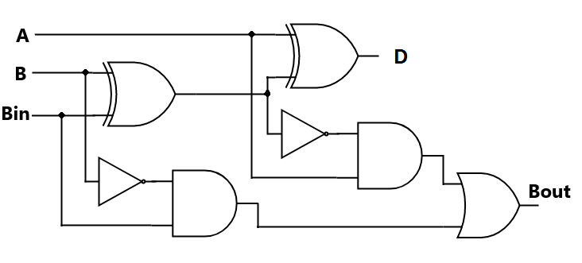

# Full Subtractor using VSDSquadron Mini

## Overview
This project implements a **Full Subtractor combinational circuit** using the **VSDSquadron Mini**, a RISC-V-based SoC development kit. The Full Subtractor performs binary subtraction by considering two input bits and a borrow-in, producing a difference and borrow-out.

This project demonstrates the practical application of **digital logic design** with **RISC-V architecture**, handling binary data through GPIO pins. The full subtractor is simulated using **PlatformIO IDE**, and results are displayed using **LED indicators**.

## Components Required
- **VSDSquadron Mini Board**  
- **Push Buttons (3x)**  
- **LEDs (2x: Red & Blue)**  
- **Breadboard**  
- **Jumper Wires**  
- **VS Code & PlatformIO**  

## Logical Diagram and Expressions

### Difference (D):
```
D = (A XOR B) XOR Bin
  = Bin XOR (A XOR B)
```

### Borrow Out (Bout):
```
Bout = A'Bin + A'B + BBin
```

## Hardware Connections

| VSDSquadron Mini Pin | Hardware Connection |
|----------------------|---------------------|
| **GND** | Common ground for LEDs & switches |
| **PD1** | Switch 1 cathode (**A**) |
| **PD2** | Switch 2 cathode (**B**) |
| **PD3** | Switch 3 cathode (**Bin**) |
| **PC4** | **Red LED** (Indicates Borrow) |
| **PC5** | **Blue LED** (Indicates Difference) |

## Truth Table

| A | B | Bin | Difference (D) (Blue LED) | Borrow Out (Bout) (Red LED) |
|---|---|---|---|---|
| 0 | 0 | 0 | 0 | 0 |
| 0 | 0 | 1 | 1 | 1 |
| 0 | 1 | 0 | 1 | 1 |
| 0 | 1 | 1 | 0 | 1 |
| 1 | 0 | 0 | 1 | 0 |
| 1 | 0 | 1 | 0 | 0 |
| 1 | 1 | 0 | 0 | 0 |
| 1 | 1 | 1 | 1 | 1 |

---
## Circuit Connections


## Code 

    #include <stdio.h>
    #include <debug.h>
    #include <ch32v00x.h>

    // Defining the Logic Gate Functions
    int and(int bit1, int bit2)
    {
     int out = bit1 & bit2;
     return out;
    }
    int or(int bit1, int bit2)
    {
      int out = bit1 | bit2;
      return out;
    }
    int xor(int bit1, int bit2)
    {
      int out = bit1 ^ bit2;
      return out;
    }
    int not(int bit)
    {
      int out = ~bit & 1; // Ensuring only the least significant bit is considered
      return out;
    }

    // Configuring GPIO Pins
    void GPIO_Config(void)
    {
    GPIO_InitTypeDef GPIO_InitStructure = {0}; // structure variable used for GPIO configuration
    RCC_APB2PeriphClockCmd(RCC_APB2Periph_GPIOD, ENABLE); // to enable the clock for port D
    RCC_APB2PeriphClockCmd(RCC_APB2Periph_GPIOC, ENABLE); // to enable the clock for port C
    
    // Input Pins Configuration
    GPIO_InitStructure.GPIO_Pin = GPIO_Pin_1 | GPIO_Pin_2 | GPIO_Pin_3;
    GPIO_InitStructure.GPIO_Mode = GPIO_Mode_IPU; // Defined as Input Type with pull-up
    GPIO_Init(GPIOD, &GPIO_InitStructure);

    // Output Pins Configuration
    GPIO_InitStructure.GPIO_Pin = GPIO_Pin_4 | GPIO_Pin_5;
    GPIO_InitStructure.GPIO_Mode = GPIO_Mode_Out_PP; // Defined Output Type
    GPIO_InitStructure.GPIO_Speed = GPIO_Speed_50MHz; // Defined Speed
    GPIO_Init(GPIOC, &GPIO_InitStructure);
    }

    // The MAIN function responsible for the execution of the program
    int main()
    {
       uint8_t A, B, Bin, Diff, Bout; // Declared the required variables
       uint8_t p, q, r; 
       NVIC_PriorityGroupConfig(NVIC_PriorityGroup_1);
       SystemCoreClockUpdate();
       Delay_Init();
       GPIO_Config();

    while(1)
    {
        A = GPIO_ReadInputDataBit(GPIOD, GPIO_Pin_1);
        B = GPIO_ReadInputDataBit(GPIOD, GPIO_Pin_2);
        Bin = GPIO_ReadInputDataBit(GPIOD, GPIO_Pin_3);
        
        // Full Subtractor Logic
        Diff = xor(xor(A, B), Bin); // Difference = A ⊕ B ⊕ Bin
        p = and(not(A), B); // p = A' B
        q = and(B, Bin); // q = B Bin
        r = and(not(A), Bin); // r = A' Bin
        Bout = or(or(p, q), r); // Borrow out = A' B + B Bin + A' Bin

        // Write the Difference output
        if(Diff == 1)
        {
            GPIO_WriteBit(GPIOC, GPIO_Pin_4, RESET); // LED on for Difference = 1
        }
        else
        {
            GPIO_WriteBit(GPIOC, GPIO_Pin_4, SET); // LED off for Difference = 0
        }

        // Write the Borrow output
        if(Bout == 1)
        {
            GPIO_WriteBit(GPIOC, GPIO_Pin_5, RESET); // LED on for Borrow out = 1
        }
        else
        {
            GPIO_WriteBit(GPIOC, GPIO_Pin_5, SET); // LED off for Borrow out = 0
        }
    }
    }
