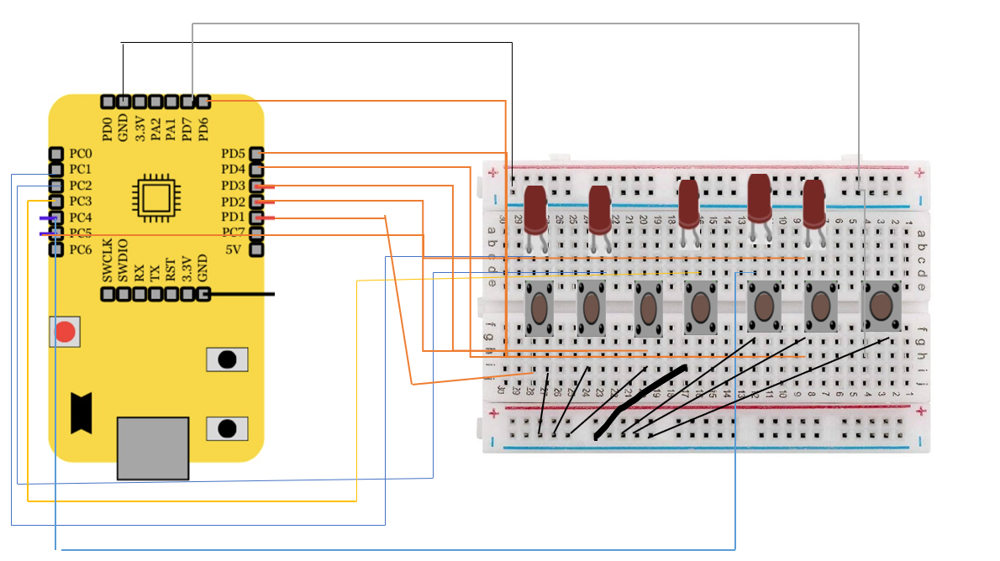

# **Three Bit Calculator**
---
## Overview
This project involves the implementation of a three bit calculator that performs Addition, Subtraction, OR, and AND operations on using the VSDSquadron Mini, a RISC-V-based SoC development kit. This project showcases the practical application of digital logic, GPIO operations, and RISC-V programming. Push-button switches are used to input binary data and select operations, and the results are displayed using LEDs.

---
## Components Required
- VSDSquadron Mini Board: RISC-V-based development kit.
- Push Buttons (7):
3 for binary inputs of A (A2, A1, A0).
3 for binary inputs of B (B2, B1, B0).
1 for operation selection.
- 5 LEDs:
3 for the Result (Sum/Difference/OR/AND for bits R2, R1, R0).
2 for Carry/Borrow (C2, C1).
- Resistors : To protect LEDs.
- Breadboard
- Jumper Wires
- VS Code with PlatformIO: For writing and uploading code.

---
## Logical Expressions and Truth Table
Addition:

| **Input A** | **Input B** | **Sum (Result LED)** | **Carry (LED)** |
|-------------|-------------|----------------------|-----------------|
| 0           | 0           | 0                    | 0               |
| 0           | 1           | 1                    | 0               |
| 1           | 0           | 1                    | 0               |
| 1           | 1           | 0                    | 1               |

Subtraction:

| **Input A** | **Input B** | **Difference (Result LED)** | **Borrow (LED)** |
|-------------|-------------|----------------------------|------------------|
| 0           | 0           | 0                          | 0                |
| 0           | 1           | 1                          | 1                |
| 1           | 0           | 1                          | 0                |
| 1           | 1           | 0                          | 0                |

OR: Result = A OR B
| **Input A** | **Input B** | **OR Result (LED)** |
|-------------|-------------|---------------------|
| 0           | 0           | 0                   |
| 0           | 1           | 1                   |
| 1           | 0           | 1                   |
| 1           | 1           | 1                   |

AND: Result = A AND B
| **Input A** | **Input B** | **AND Result (LED)** |
|-------------|-------------|----------------------|
| 0           | 0           | 0                    |
| 0           | 1           | 0                    |
| 1           | 0           | 0                    |
| 1           | 1           | 1                    |

---
## Hardware Connections
- Input : 6 inputs of single bit for A and B and 1 for Operation selection are connected to the GPIO pins if VSDSquadron Mini via push buttons mounted on the breadboard.
- Output : 5 LEDs are connected to display the result of Calculator
- The GPIO pins are configured according to the Reference Mannual, ensuring the correct flow of signals between the components.

---
## Circuit Connections

## Code 

    #include <stdio.h>
    #include <ch32v00x.h>
    int and(int bit1, int bit2) { return bit1 & bit2; }
    int or(int bit1, int bit2) { return bit1 | bit2; }
    int xor(int bit1, int bit2) { return bit1 ^ bit2; }
    int not(int bit) { return ~bit & 1; }

    void GPIO_Config(void) {

    GPIO_InitTypeDef GPIO_InitStructure = {0};
    RCC_APB2PeriphClockCmd(RCC_APB2Periph_GPIOD, ENABLE);
    
    RCC_APB2PeriphClockCmd(RCC_APB2Periph_GPIOC, ENABLE);

    
    GPIO_InitStructure.GPIO_Pin = GPIO_Pin_1 | GPIO_Pin_2 | GPIO_Pin_3 | GPIO_Pin_4 | GPIO_Pin_5 | GPIO_Pin_6 | GPIO_Pin_7;
    GPIO_InitStructure.GPIO_Mode = GPIO_Mode_IPU;
    GPIO_Init(GPIOD, &GPIO_InitStructure);

    GPIO_InitStructure.GPIO_Pin = GPIO_Pin_1 | GPIO_Pin_2 | GPIO_Pin_3 | GPIO_Pin_4 | GPIO_Pin_5;
    GPIO_InitStructure.GPIO_Mode = GPIO_Mode_Out_PP;
    GPIO_InitStructure.GPIO_Speed = GPIO_Speed_50MHz;
    GPIO_Init(GPIOC, &GPIO_InitStructure);
    }

    void FullAdder(uint8_t A, uint8_t B, uint8_t Cin, uint8_t *Sum, uint8_t *Carry) {
    *Sum = xor(xor(A, B), Cin);
    *Carry = or(and(A, B), and(Cin, xor(A, B)));
    }

    void FullSubtractor(uint8_t A, uint8_t B, uint8_t Bin, uint8_t *Diff, uint8_t *Borrow) {
    *Diff = xor(xor(A, B), Bin);
    *Borrow = or(and(not(A), B), and(Bin, not(xor(A, B))));
    }

    int main() {
    uint8_t A, B, Cin, Bin, Op, Result[3], Carry[3], Borrow[3];
    GPIO_Config();

    while (1) {
        A = GPIO_ReadInputDataBit(GPIOD, GPIO_Pin_1) |
            (GPIO_ReadInputDataBit(GPIOD, GPIO_Pin_2) << 1) |
            (GPIO_ReadInputDataBit(GPIOD, GPIO_Pin_3) << 2);
        B = GPIO_ReadInputDataBit(GPIOD, GPIO_Pin_4) |
            (GPIO_ReadInputDataBit(GPIOD, GPIO_Pin_5) << 1) |
            (GPIO_ReadInputDataBit(GPIOD, GPIO_Pin_6) << 2);
        Op = GPIO_ReadInputDataBit(GPIOD, GPIO_Pin_7);

        if (Op == 0) {
            FullAdder(A & 1, B & 1, 0, &Result[0], &Carry[0]);
            FullAdder((A >> 1) & 1, (B >> 1) & 1, Carry[0], &Result[1], &Carry[1]);
            FullAdder((A >> 2) & 1, (B >> 2) & 1, Carry[1], &Result[2], &Carry[2]);
        } else if (Op == 1) {
            FullSubtractor(A & 1, B & 1, 0, &Result[0], &Borrow[0]);
            FullSubtractor((A >> 1) & 1, (B >> 1) & 1, Borrow[0], &Result[1], &Borrow[1]);
            FullSubtractor((A >> 2) & 1, (B >> 2) & 1, Borrow[1], &Result[2], &Borrow[2]);
        } else if (Op == 2) {
            Result[0] = and(A & 1, B & 1);
            Result[1] = and((A >> 1) & 1, (B >> 1) & 1);
            Result[2] = and((A >> 2) & 1, (B >> 2) & 1);
        } else if (Op == 3) {
            Result[0] = or(A & 1, B & 1);
            Result[1] = or((A >> 1) & 1, (B >> 1) & 1);
            Result[2] = or((A >> 2) & 1, (B >> 2) & 1);
        }

        GPIO_WriteBit(GPIOC, GPIO_Pin_1, Result[0] ? RESET : SET);
        GPIO_WriteBit(GPIOC, GPIO_Pin_2, Result[1] ? RESET : SET);
        GPIO_WriteBit(GPIOC, GPIO_Pin_3, Result[2] ? RESET : SET);

        if (Op == 0) {
            GPIO_WriteBit(GPIOC, GPIO_Pin_4, Carry[1] ? RESET : SET);
            GPIO_WriteBit(GPIOC, GPIO_Pin_5, Carry[2] ? RESET : SET);
        } else if (Op == 1) {
            GPIO_WriteBit(GPIOC, GPIO_Pin_4, Borrow[1] ? RESET : SET);
            GPIO_WriteBit(GPIOC, GPIO_Pin_5, Borrow[2] ? RESET : SET);
        } else {
            GPIO_WriteBit(GPIOC, GPIO_Pin_4, SET);
            GPIO_WriteBit(GPIOC, GPIO_Pin_5, SET);
        }
    }
    }

