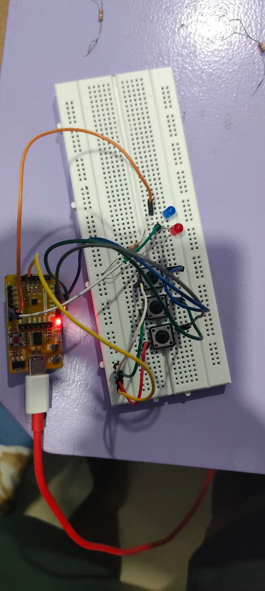

<details>
  <summary>Final Working Code</summary>

  ```c
  #include <stdio.h>
  #include <debug.h>
  #include <ch32v00x.h>

  // Defining the Logic Gate Functions
  int and(int bit1, int bit2) {
      int out = bit1 & bit2;
      return out;
  }
  int or(int bit1, int bit2) {
      int out = bit1 | bit2;
      return out;
  }
  int xor(int bit1, int bit2) {
      int out = bit1 ^ bit2;
      return out;
  }
  int not(int bit) {
      int out = ~bit & 1; // Ensuring only the least significant bit is considered
      return out;
  }

  // Configuring GPIO Pins
  void GPIO_Config(void) {
      GPIO_InitTypeDef GPIO_InitStructure = {0}; // structure variable used for GPIO configuration
      RCC_APB2PeriphClockCmd(RCC_APB2Periph_GPIOD, ENABLE); // to enable the clock for port D
      RCC_APB2PeriphClockCmd(RCC_APB2Periph_GPIOC, ENABLE); // to enable the clock for port C
      
      // Input Pins Configuration
      GPIO_InitStructure.GPIO_Pin = GPIO_Pin_1 | GPIO_Pin_2 | GPIO_Pin_3;
      GPIO_InitStructure.GPIO_Mode = GPIO_Mode_IPU; // Defined as Input Type with pull-up
      GPIO_Init(GPIOD, &GPIO_InitStructure);

      // Output Pins Configuration
      GPIO_InitStructure.GPIO_Pin = GPIO_Pin_4 | GPIO_Pin_5;
      GPIO_InitStructure.GPIO_Mode = GPIO_Mode_Out_PP; // Defined Output Type
      GPIO_InitStructure.GPIO_Speed = GPIO_Speed_50MHz; // Defined Speed
      GPIO_Init(GPIOC, &GPIO_InitStructure);
  }

  // The MAIN function responsible for the execution of the program
  int main() {
      uint8_t A, B, Bin, Diff, Bout; // Declared the required variables
      uint8_t p, q, r; 
      NVIC_PriorityGroupConfig(NVIC_PriorityGroup_1);
      SystemCoreClockUpdate();
      Delay_Init();
      GPIO_Config();

      while(1) {
          A = GPIO_ReadInputDataBit(GPIOD, GPIO_Pin_1);
          B = GPIO_ReadInputDataBit(GPIOD, GPIO_Pin_2);
          Bin = GPIO_ReadInputDataBit(GPIOD, GPIO_Pin_3);
          
          // Full Subtractor Logic
          Diff = xor(xor(A, B), Bin); // Difference = A ⊕ B ⊕ Bin
          p = and(not(A), B); // p = A' B
          q = and(B, Bin); // q = B Bin
          r = and(not(A), Bin); // r = A' Bin
          Bout = or(or(p, q), r); // Borrow out = A' B + B Bin + A' Bin

          // Write the Difference output
          GPIO_WriteBit(GPIOC, GPIO_Pin_4, Diff ? RESET : SET); // LED on for Difference = 1

          // Write the Borrow output
          GPIO_WriteBit(GPIOC, GPIO_Pin_5, Bout ? RESET : SET); // LED on for Borrow out = 1
      }
  }
  ```

</details>




[Working Video 1](https://drive.google.com/file/d/1ChRL2KAyMbMCjR5JCGeyGEt7VURKAyvw/view?usp=drive_link)
---
[Working Video 2](https://drive.google.com/file/d/14_bQ0Gh6TKZn-v2zTc3v1tcF60O1c9Sg/view?usp=drive_link)
---
