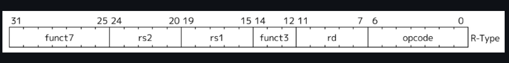
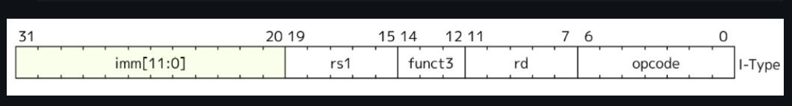
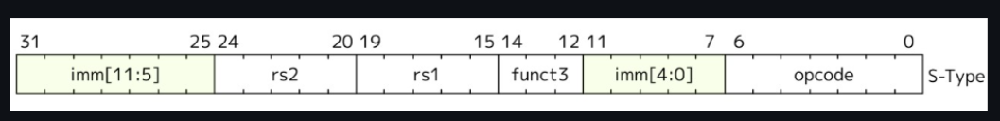
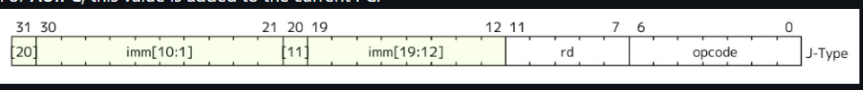
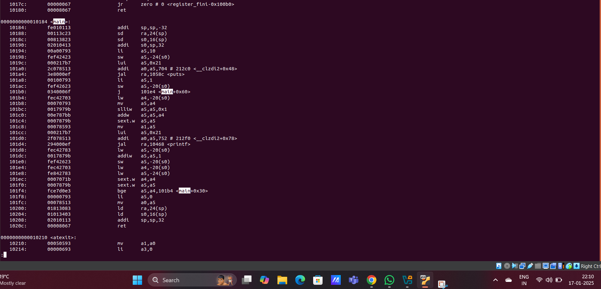

# Decoding RISC-V Instructions: A Visual Guide

---

#### Instruction Types and Fields
RISC-V instructions are categorized as:
- **R-type**: Register type
- **I-type**: Immediate type
- **S-type**: Store type
- **B-type**: Branch type
- **U-type**: Upper immediate type
- **J-type**: Jump type

#### Opcode and Function Fields
- **Opcode**: Determines the type of instruction.
- **func3 and func7**: Specify operations within an instruction type.
----
### R type

- **Opcode**: Specifies the operation (e.g., 0110011 means it's for register-register operations).
- **rd**: The destination register where the result will be stored.
- **funct3**: It helps to narrow down the operation within the R-Type family (like addition or subtraction).
- **rs1**: The first source register.
- **rs2**: The second source register.
- **funct7**: Further helps specify the operation.
- Similarly all other types have these fields
---

### I type 

---
### S Type

---
### B Type 

---
### U Type

---
### J Type 

---

### **Machine Code for each instruction**

---

### 1. **I-Type: `addi sp, sp, -32`**

**Description**: Adds the immediate value `-32` to the contents of `sp` (x2), storing the result back in `sp` (x2).

**Binary Fields**:
- `opcode`: `0010011` (for addi)
- `funct3`: `000` (for addi)
- `rd`: `00010` (sp = x2)
- `rs1`: `00010` (sp = x2)
- `imm`: `111111111000` (12-bit immediate = -32)

**32-bit Instruction**:  
`111111111000 00010 000 00010 0010011`

**Hex**: 
`fe010113`
---
### 2. **S-Type: `sd ra, 24(sp)`**

**Description**: Stores the value in `ra` (x1) into memory at the address `sp + 24`.

**Binary Fields**:
- `opcode`: `0100011` (for store instructions like sd)
- `funct3`: `011` (for sd)
- `rs2`: `00001` (ra = x1)
- `rs1`: `00010` (sp = x2)
- `imm`: `24` (12-bit immediate split as imm[11:5] = `0000000`, imm[4:0] = `11000`)

**32-bit Instruction**:  
`0000000 00001 00010 011 11000 0100011`

**Hex**: `00113c23`
---
### 3. **I-Type: `li a5, 10` (Equivalent to `addi a5, x0, 10`)**

**Description**: Loads the immediate value `10` into register `a5` (x15).

**Binary Fields**:
- `opcode`: `0010011` (for addi)
- `funct3`: `000` (for addi)
- `rd`: `01111` (a5 = x15)
- `rs1`: `00000` (x0)
- `imm`: `10` (12-bit immediate: `000000000010`)

**32-bit Instruction**:  
`000000000010 00000 000 01111 0010011`
**Hex**: `00a00793`
---
### 4. **S-Type: `sw a5, -24(s0)`**

**Description**: Stores the contents of register `a5` (x15) into the memory address computed by adding `-24` to the value in register `s0` (x8).

**Binary Fields**:
- `opcode`: `0100011` (for store instructions like sw)
- `funct3`: `010` (for sw)
- `rs1`: `01000` (s0 = x8)
- `rs2`: `01111` (a5 = x15)
- `imm`: `-24` (12-bit immediate: `1111111111001000`)

**Split Immediate**:
- `imm[11:5]`: `1111111`
- `imm[4:0]`: `01000`

**32-bit Instruction**:  
`1111111 01111 01000 010 01000 0100011`
**Hex**: 'fef42423
---
### 5. **U-Type: `lui a5, 0x21`**

**Description**: Loads the upper immediate `0x21` into the upper 20 bits of register `a5`.

**Binary Fields**:
- `opcode`: `0110111` (for LUI)
- `rd`: `01111` (a5 = x15)
- `imm[31:12]`: `0000000000100001` (upper 20 bits of `0x21`)

**32-bit Instruction**:  
`0000000000100001 01111 0110111`

**Hexadecimal**:  
`000217b7`
---
### 6. **J-Type: `jal ra, 1058c <puts>`**

**Description**: Jump and link to the target address `1058c`, storing the return address in register `ra`.

**Binary Fields**:
- `opcode`: `1101111` (for jal)
- `rd`: `00001` (ra = x1)
- `imm[20]`: `0`
- `imm[10:1]`: `0111101100`
- `imm[11]`: `1`
- `imm[19:12]`: `00000100`

**32-bit Instruction**:  
`0 00000100 1 0111101100 00001 1101111`

**Hexadecimal**:  
`3e8000ef`
---
### 7. **J-Type: `j 101e4,<main+0x60>`**

**Description**: Unconditional jump to the target address `101e4`.

**Binary Fields**:
- `opcode`: `1101111` (for j)
- `rd`: `00000` (x0, no return address stored)
- `imm[20]`: `0`
- `imm[10:1]`: `0000110100`
- `imm[11]`: `0`
- `imm[19:12]`: `00000000`

**32-bit Instruction**:  
`0 00000000 0 0000110100 00000 1101111`

**Hexadecimal**:  
`0340006f`
---
### 8. **I-Type: `lw a4, -20(s0)`**

**Description**: Loads a word from memory at the address `s0 - 20` into register `a4`.

**Binary Fields**:
- `opcode`: `0000011` (for load instructions like lw)
- `funct3`: `010` (for lw)
- `rd`: `01110` (a4 = x14)
- `rs1`: `01000` (s0 = x8)
- `imm`: `11111111101100` (12-bit 2's complement for -20)

**32-bit Instruction**:  
`111111111011 01000 010 01110 0000011`

**Hexadecimal**:  
`fec42703`
---
### 9. **I-Type: `mv a5, a4`**

**Description**: The `mv` instruction is a pseudo-instruction in RISC-V, which is translated by the assembler into:
- `mv a5, a4 → addi a5, a4, 0`

This effectively copies the value in register `a4` to register `a5`.

**Binary Fields**:
- `opcode`: `0010011` (for addi)
- `funct3`: `000` (for addi)
- `rd`: `01111` (a5 = x15)
- `rs1`: `01110` (a4 = x14)
- `imm`: `000000000000` (immediate value 0)

**32-bit Instruction**:  
`000000000000 01110 000 01111 0010011`

**Hexadecimal**:  
`00070793`
---
### 10. **S-Type: `slliw a5, a5, 0x1`**

**Description**: The `slliw` instruction performs a logical left shift on a 32-bit value. The value in `a5` is shifted left by 1 bit, and the result is stored back in `a5`.

**Binary Fields**:
- `opcode`: `0011011` (for `slliw`)
- `funct3`: `001` (for `slliw`)
- `rd`: `01111` (a5 = x15)
- `rs1`: `01111` (a5 = x15)
- `imm`: `000000000001` (shift amount 1)

**32-bit Instruction**:  
`000000000001 01111 001 01111 0011011`

**Hexadecimal**:  
`0017979b`
---

### 11. **R-Type: `addw a5, a5, a4`**

**Description**: Adds the contents of `a5` and `a4` as 32-bit values, storing the result in `a5`.

**Binary Fields**:
- `opcode`: `0110011` (for `addw`)
- `funct7`: `0000000`
- `funct3`: `000`
- `rs1`: `01111` (a5 = x15)
- `rs2`: `01110` (a4 = x14)
- `rd`: `01111` (a5 = x15)

**32-bit Instruction**:  
`0000000 01110 01111 000 01111 0110011`

**Hexadecimal**:  
`00e787bb`
---

### 12. **I-Type: `addiw a5, a5, 1`**

**Description**: Adds the contents of `a5` and the immediate value `1` as 32-bit values, storing the result in `a5`.

**Binary Fields**:
- `opcode`: `0010011` (for `addiw`)
- `funct3`: `000`
- `rd`: `01111` (a5 = x15)
- `rs1`: `01111` (a5 = x15)
- `imm`: `000000000001` (Immediate value = 1)

**32-bit Instruction**:  
`000000000001 01111 000 01111 0010011`

**Hexadecimal**:  
`0017879b`
---
### 13. **I-Type: `sext.w a4, a4`**

**Description**: This instruction performs a sign extension of the word (`w` stands for word, i.e., 32 bits) in `a4` and stores the result back into `a4`.

**Binary Fields**:
- `opcode`: `0001011` (for `sext.w`)
- `funct3`: `100` (for `sext.w`)
- `rs1`: `01110` (a4 = x14)
- `rd`: `01110` (a4 = x14)
- `imm[11:0]`: `000000000000` (no immediate value as it's a sign extension)

**32-bit Instruction**:  
`000000000000 01110 100 01110 0001011`

**Hexadecimal**:  
`0007071b`
---
### 14. **B-Type: `bge a5, a4, 101b4 <main+0x30>`**

**Description**: This instruction performs a branch if greater than or equal. If the value in register `a5` is greater than or equal to the value in register `a4`, it branches to the address `101b4`.

**Binary Fields**:
- `opcode`: `1100011` (for `bge` and other branch instructions)
- `funct3`: `101` (for `bge`)
- `rs1`: `01110` (a5 = x15)
- `rs2`: `01101` (a4 = x14)
- `imm`: The offset is calculated as the difference between the target address (`101b4`) and the current PC.
**32-bit Binary Format**:  
`0 000011 0100 0 0 01101 01110 101 000000 1100011`

**Hexadecimal**:  
`fce7d0e3`
---

### 15. **I-Type: `ld ra, 24(sp)`**

**Description**: This instruction loads a 64-bit word from the memory address `24` bytes above the stack pointer (`sp`) and stores it in the `ra` register.

**Binary Fields**:
- `opcode`: `0000011` (for load instructions like `ld`)
- `funct3`: `011` (for `ld` instruction)
- `rd`: `ra = x1 → 00001`
- `rs1`: `sp = x2 → 00010`
- `imm`: The immediate value is `24`, represented as `00000000011000` (12-bit immediate).

**32 bit Instructions**:  
`000000000110 00010 011 00001 0000011`

**Hexadecimal**:  
`01813083`
---

