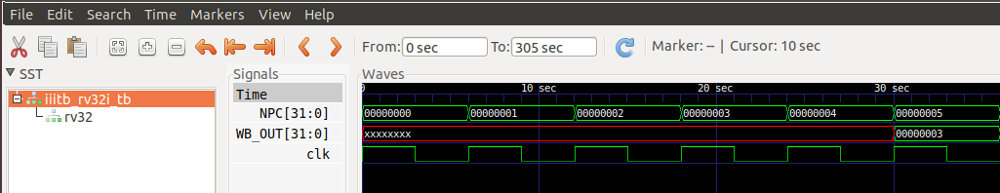
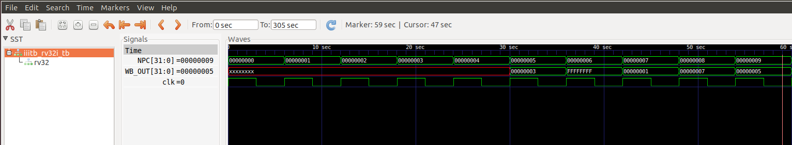
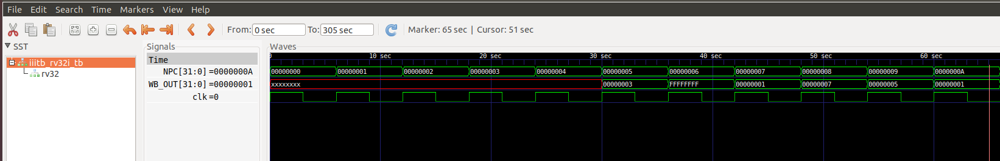
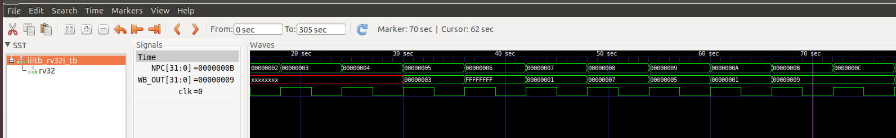

# The Output Waveforms

- instruction 1 : addi

-instruction 2 : sd

.png)

-instruction 3 : sd

.png)

-instruction 4 : addi

.png)

-instruction 5 : li

-instruction 6 : sw

-instruction 7 : lui

